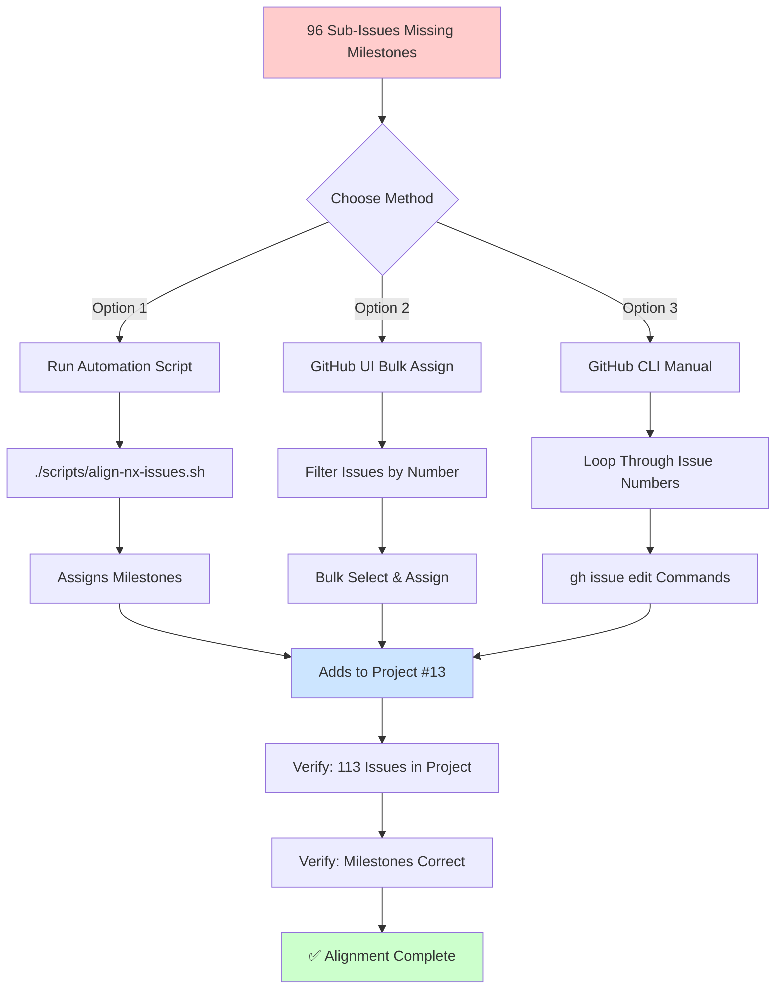

# NX Issues Visual Structure

## Overview

```
NX Plugin Development
│
├── NX-1: Bootstrap (Milestone #10)
│   ├── 24 Sub-Issues (Claude, Codex, Gemini, Copilot phases)
│   └── 4 Parent Issues (#36, #37, #40, #41)
│       ├── #36: Set up plugin testing infrastructure
│       ├── #37: Add shared utilities: validate config
│       ├── #40: Implement init generator
│       └── #41: Create Nx plugin package skeleton
│
├── NX-2: Worker Gen (Milestone #11)
│   ├── 20 Sub-Issues (Claude, Codex, Gemini, Copilot phases)
│   └── 3 Parent Issues (#31, #32, #34)
│       ├── #31: Create worker generator tests
│       ├── #32: Define executor-to-wrangler mapping
│       └── #34: Add /health endpoint to template
│
├── NX-3: Tenant Gen (Milestone #12)
│   ├── 20 Sub-Issues (Claude, Codex, Gemini, Copilot phases)
│   └── 5 Parent Issues (#26, #27, #28, #29, #30)
│       ├── #26: Create tenant generator tests
│       ├── #27: Add tenant registry file for discoverability
│       ├── #28: Generate wrangler.jsonc template
│       ├── #29: Generate tenant.config.json template
│       └── #30: Scaffold tenant folder structure
│
└── NX-4: Bindings (Milestone #13)
    ├── 32 Sub-Issues (Claude, Codex, Gemini, Copilot phases)
    └── 5 Parent Issues (#18, #20, #21, #22, #23)
        ├── #18: Create binding generator/executor tests
        ├── #20: Add dry-run mode to deployAll
        ├── #21: Add concurrency policy to deployAll
        ├── #22: Implement deployAll executor
        └── #23: Add DO class skeleton generation

Total: 96 sub-issues + 17 parent issues = 113 issues
```

## Phase Distribution

Each sub-issue follows a 4-phase workflow:

```
Phase 1: Architecture & Design (agent:claude)
   ↓
Phase 2: Implementation (agent:codex)
   ↓
Phase 3: Testing (agent:gemini)
   ↓
Phase 4: Documentation & DX (agent:copilot)
```

### Current Phase Assignments

All issues are already correctly labeled with phase tags based on their agent prefix:
- `[NX-n][Claude]` → `agent:claude` (Architecture)
- `[NX-n][Codex]` → `agent:codex` (Implementation)
- `[NX-n][Gemini]` → `agent:gemini` (Testing)
- `[NX-n][Copilot]` → `agent:copilot` (Documentation)

✅ **No phase changes required**

## Issue Distribution by Milestone

```
┌─────────────────────────────────────────────────────────┐
│ NX-1: Bootstrap                                         │
│ ▓▓▓▓▓▓▓▓▓▓▓▓ 24 sub-issues                             │
│ Total: 28 issues (24 sub + 4 parent)                   │
└─────────────────────────────────────────────────────────┘

┌─────────────────────────────────────────────────────────┐
│ NX-2: Worker Gen                                        │
│ ▓▓▓▓▓▓▓▓▓▓ 20 sub-issues                                │
│ Total: 23 issues (20 sub + 3 parent)                   │
└─────────────────────────────────────────────────────────┘

┌─────────────────────────────────────────────────────────┐
│ NX-3: Tenant Gen                                        │
│ ▓▓▓▓▓▓▓▓▓▓ 20 sub-issues                                │
│ Total: 25 issues (20 sub + 5 parent)                   │
└─────────────────────────────────────────────────────────┘

┌─────────────────────────────────────────────────────────┐
│ NX-4: Bindings                                          │
│ ▓▓▓▓▓▓▓▓▓▓▓▓▓▓▓▓ 32 sub-issues                          │
│ Total: 37 issues (32 sub + 5 parent)                   │
└─────────────────────────────────────────────────────────┘
```

## Workflow for Alignment



## Sub-Issue Naming Convention

All sub-issues follow this pattern:

```
[NX-n][Agent] Task description

Examples:
- [NX-1][Claude] Define plugin architecture
- [NX-2][Codex] Implement worker generator
- [NX-3][Gemini] Write tenant generator tests
- [NX-4][Copilot] Add deployment documentation
```

Where:
- `NX-n`: Milestone identifier (1-4)
- `Agent`: Phase/agent responsible (Claude, Codex, Gemini, Copilot)
- `Task description`: Specific deliverable

## Parent Issue References

Sub-issues reference their parent in the issue body:

```markdown
Parent: #XX

Task details...
```

Example from issue #239:
```markdown
Parent: #18

Document:
- Test binding generators
- Mock wrangler in executor tests
- Snapshot update process
- CI gate configuration
```

## GitHub Project Structure

All issues will be organized in [Project #13](https://github.com/users/rainbowkillah/projects/13/):

```
AI Multi-Tenant Monorepo (Project #13)
│
├── NX-1: Bootstrap (Milestone view)
│   └── 28 issues (24 sub + 4 parent)
│
├── NX-2: Worker Gen (Milestone view)
│   └── 23 issues (20 sub + 3 parent)
│
├── NX-3: Tenant Gen (Milestone view)
│   └── 25 issues (20 sub + 5 parent)
│
└── NX-4: Bindings (Milestone view)
    └── 37 issues (32 sub + 5 parent)

Total: 113 issues tracked
```

## Status After Alignment

### Before Alignment (Current State)
- ❌ 96 sub-issues with NO_MILESTONE
- ❌ Issues not in Project #13
- ✅ Phase labels already correct

### After Alignment (Target State)
- ✅ All 96 sub-issues assigned to correct milestone
- ✅ All 113 issues (96 sub + 17 parent) in Project #13
- ✅ Phase labels remain correct (no changes)
- ✅ Trackable progress across 4 milestones

## Quick Commands

### Check Current Status
```bash
# Count issues without milestones
gh issue list --label sub-issue --json milestone | \
  jq '[.[] | select(.milestone == null)] | length'

# Expected: 96
```

### After Alignment
```bash
# Verify milestone assignments
gh issue list --milestone "NX-1: Bootstrap" --json number | jq '. | length'  # Expect: 24+
gh issue list --milestone "NX-2: Worker Gen" --json number | jq '. | length'  # Expect: 20+
gh issue list --milestone "NX-3: Tenant Gen" --json number | jq '. | length'  # Expect: 20+
gh issue list --milestone "NX-4: Bindings" --json number | jq '. | length'    # Expect: 32+

# Verify project membership
gh project item-list 13 --owner rainbowkillah --format json | \
  jq '.items | length'  # Expect: 113+
```

---

**Documentation:**
- Detailed: `docs/NX-ISSUES-ALIGNMENT.md`
- Quick Ref: `docs/NX-ALIGNMENT-QUICK-REF.md`
- Script: `scripts/align-nx-issues.sh`
