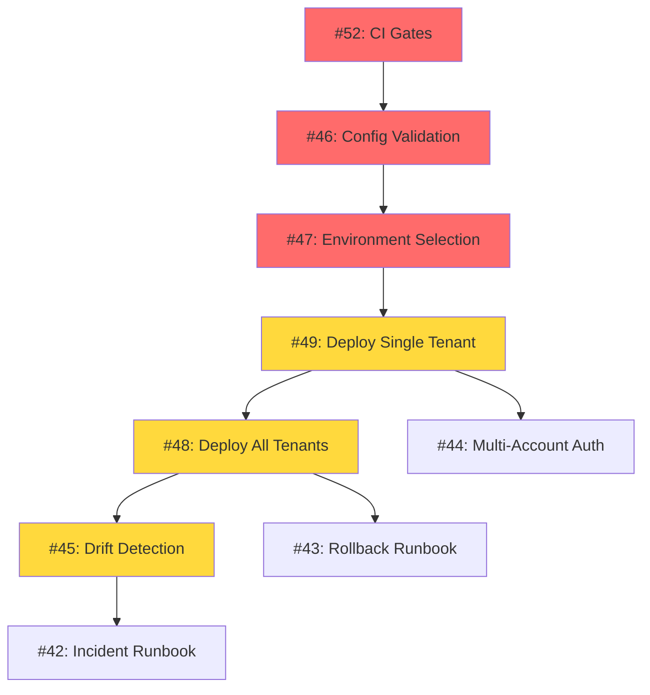

# M8: Deploy & Operations

**Status:** ✅ Complete (staging + production validated)  
**Duration:** 16-24 hours  
**Issues:** #42-#49 + #52 (9 total)  
**Prerequisites:** M6 ✅ | M7 ✅ (Tier 1 complete)  

---

## Quick Links

- **Detailed Planning Brief:** [PLANNING-BRIEF.md](./PLANNING-BRIEF.md) - Comprehensive M8 plan with technical decisions, risk assessment, and implementation order
- **M6-M7 Handoff:** [../../m6-m7-handoff.md](../../m6-m7-handoff.md) - Context on what was completed and what's pending
- **GitHub Issues:** [M8: Deploy Milestone](https://github.com/rainbowkillah/crispy-enigma/issues?q=is%3Aopen+milestone%3A%22M8%3A+Deploy%22)

---

## Goals

Transform manual `wrangler deploy` commands into:
- ✅ Automated single-tenant deployment
- ✅ Automated multi-tenant deployment  
- ✅ Config validation (fail fast)
- ✅ Drift detection (verify deployed state)
- ✅ Rollback procedures
- ✅ CI quality gates

---

## Issues at a Glance

| # | Title | Priority | Est. Hours |
|---|-------|----------|------------|
| #52 | Set up CI gates | 🔴 BLOCKER | 4-6 |
| #46 | Config validation | 🔴 HIGH | 2-3 |
| #47 | Environment selection | 🔴 HIGH | 1-2 |
| #49 | Deploy single tenant | 🟡 MEDIUM | 3-4 |
| #48 | Deploy all tenants | 🟡 MEDIUM | 2-3 |
| #45 | Drift detection | 🟡 MEDIUM | 3-4 |
| #44 | Multi-account credentials | 🟢 LOW | 2-3 |
| #43 | Rollback runbook | 🟢 LOW | 1-2 |
| #42 | Incident response runbook | 🟢 LOW | 1-2 |

**Total:** 19-29 hours (estimate includes buffer)

---

## Current State

### ✅ What Works
- 2 production tenants configured: `mrrainbowsmoke`, `rainbowsmokeofficial`
- Both have valid `tenant.config.json` and `wrangler.jsonc`
- Local dev works: `npm run dev -- --tenant=<name>`
- 198 tests passing, TypeScript compiles cleanly
- Automated deploys and drift checks verified in staging and production
- Production uses `workers.dev` URLs (no custom domains in M8 scope)

### ✅ Production Validation
- Production deploy + drift validation complete for both tenants
- Smoke checks passed for production URLs

**Production URLs**
- `https://bluey-ai-worker-production.mrrainbowsmoke.workers.dev`
- `https://azure-ai-worker-production.rainbowsmokeofficial.workers.dev`

---

## Critical Path

**Red:** Blockers (must complete first)  
**Yellow:** Core functionality  
**Green:** Documentation & runbooks  

---

## Acceptance Criteria

### Deployment Works
- [x] `npm run deploy -- --tenant=X --env=staging` succeeds for both tenants
- [x] `npm run deploy:all -- --env=staging` deploys both tenants
- [x] Invalid configs rejected before deployment attempt
- [x] Deployment logs stored in `deployments/` directory (gitignored)

### Verification Works  
- [x] `npm run drift -- --tenant=X --env=staging` detects config drift
- [x] Health check verifies deployment success
- [x] Zero secrets in git or CI logs

### Operations Ready
- [x] Rollback procedure documented and tested
- [x] Incident response runbook covers detection → resolution
- [x] CI gates prevent merging broken code

---

## Key Decisions

1. **Shell Exec for Wrangler:** Use `child_process.exec('wrangler deploy')` (simplest for M8)
2. **Local File Storage:** Store deployment logs in `deployments/` directory
3. **Sequential by Default:** Deploy tenants one at a time (safer), opt-in parallel
4. **HTTP Health Checks:** Verify deployment by calling `GET /health`

---

## Production Validation

- [x] Deploy both tenants with `--env=production`
- [x] Run drift checks for production
- [x] Run smoke checks against production URLs

See [PLANNING-BRIEF.md](./PLANNING-BRIEF.md) for detailed rationale.

---

## Risks & Mitigations

| Risk | Impact | Mitigation |
|------|--------|------------|
| Incomplete M7 CI gates | 🔴 HIGH | Make #52 hard blocker for M8 start |
| Token leaks in git/logs | 🔴 HIGH | Use `.env.deploy` (git-ignored), audit logs |
| No rollback procedure | 🟡 MEDIUM | Test rollback in staging before prod |
| Binding quota limits | 🟡 MEDIUM | Validate quotas pre-deployment |

---

## Getting Started

### For Codex (M8 Planning Agent)
1. Read [PLANNING-BRIEF.md](./PLANNING-BRIEF.md) for full context
2. Review [m6-m7-handoff.md](../../m6-m7-handoff.md) for M7 status
3. Generate detailed task breakdown for each issue
4. Create execution prompts for implementation
5. Propose order of execution (recommend: #52 → #46 → #47 → #49 → #48 → #45)

### For Developers
1. **Start Here:** Issue #52 (CI gates) - blocker for all other work
2. **Then:** Issues #46-#47 (validation + env selection)
3. **Next:** Issue #49 (single tenant deploy)
4. **Finally:** Issues #48, #45, #44, #43, #42

---

## Questions?

Refer to **Questions for Planning Session** section in [PLANNING-BRIEF.md](./PLANNING-BRIEF.md#questions-for-planning-session).

**Ready to automate deployments! 🚀**
